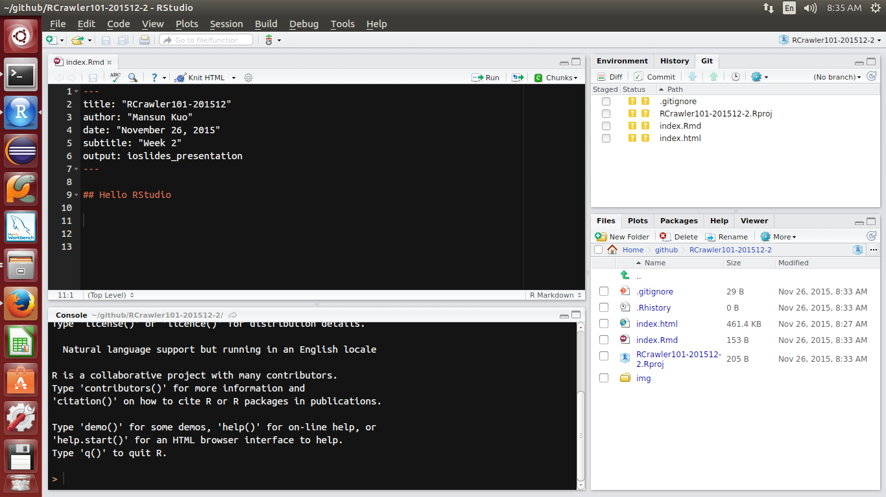
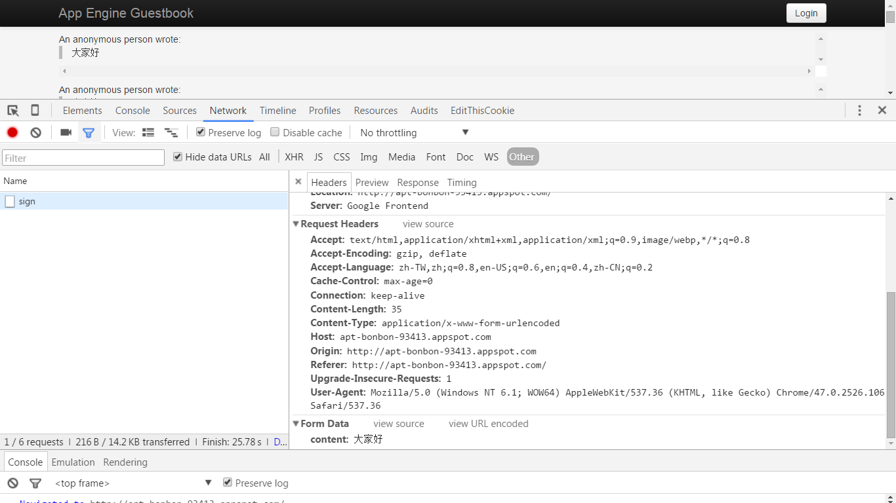

```{r include=FALSE}
library(knitr)
knitr::opts_chunk$set(warning = TRUE,
                      echo = TRUE,
                      message = TRUE,
                      fig.align='center',
                      cache=FALSE)
knitr::opts_knit$set(root.dir = '.')
```

## Hello RStudio




## Must-known keyboard shortcuts

[AllRStudio keyboard shortcuts](https://support.rstudio.com/hc/en-us/articles/200711853-Keyboard-Shortcuts)

Description                      | Windows & Linux    | Mac
-------------------------------- | ------------------ | ---
Show Keyboard Shortcut Reference | Alt+Shift+K        | Option+Shift+K
Attempt completion / Indent	     | Tab or Ctrl+Space  | Tab or Command+Space
Run current line/selection       | Ctrl+Enter         | Command+Enter
Comment/uncomment current line/selection | Ctrl+Shift+C | Command+Shift+C
Save active document             | Ctrl+S             | Command+S
Reindent lines                   | Ctrl+I             | Command+I


## R recap

- ?, ??, how to read manuel
- Working Environment
- Basic Data Structure
- function
- str, type, class
- for, if/else ifelse 
- apply/lapply/sapply, unlist
- do.call
- [magrittr](https://github.com/smbache/magrittr)
- [data.table](https://cran.r-project.org/web/packages/data.table/index.html)


## How to get help

- `?`: Access ducument in R console
- `??`: Search the halp system
- google with appropriate keyword. For example:
    - R {package name}
    - R {algorithm name}
- Forum
    - [Taiwan R user Group](http://www.meetup.com/Taiwan-R/)  
      A free R/data analysis user group in Taiwan
    - [Stack Overflow](http://stackoverflow.com/questions/tagged/r)  
      A question and answer site for programmers
    - [PTT R_Language board](https://www.ptt.cc/bbs/R_Language/index.html)  
      A bbs forum for R in Taiwan


## Working Environment

Using `getwd`/`setwd` to get/set your working directory.

```{r}
wd = getwd()
setwd("img")
getwd()
setwd(wd)
getwd()
```

If you [using Projects](https://support.rstudio.com/hc/en-us/articles/200526207-Using-Projects),
RStudio will change working directory for you automatically.


## Basic Data Structure

Vector, Matrix, Array, List and Data frame are the most basic data structure in R.
These data structures can be mapped into a table according to:

- dimension
- Homogeneous or Heterogeneous of data type


<br> | Homogeneous     | Heterogeneous
---  | --------------- |-------------
1d   | Atomic vector   | List
2d   | Matrix          | Data frame
nd   | Array	


## Data structure

All data structures above are objects.
They apply different methods and saved as different type internally.

```{r echo = FALSE}
x <- data.frame(object = c('c(1, 2.5, 3)', 
                           'c("male", "female", "female", "male")',
                           'factor(c("male", "female", "female", "male"))', 
                           'matrix(1:9, nrow = 3)',
                           'list(a = 1:10, b = c("apple", "banana"))',
                           'data.frame(a = 1, b = "z")'))
x$type <- sapply(parse(text = sprintf("typeof(%s)", x$object)), eval)
x$class <- sapply(parse(text = sprintf("class(%s)", x$object)), eval)
knitr::kable(x)
```


## Function 

*To understand computations in R, two slogans are helpful:*

- *Everything that exists is an object.*
- *Everything that happens is a function call."*

*— John Chambers*

<div class="columns-2">

```{r}
`+`
`<-`
`[`
`c`
```

</div>


## Function in R

A typical function in R may look like:

```{r}
f <- function(arg1, arg2, ...) {
    # Some magic happened
    return()    # return something
}
```

- If you don't use `return` to specify the return value, 
  the return value will be the last expression inside the function.
- Call by value by default  
  send a copy of a object into a function and the input object won't change after execution without assignment
- [First class object](https://en.wikipedia.org/wiki/First-class_citizen)
     - Can be passed as arguments to other functions
     - Can be nested


## If

The basc structure of conditional execution in R is:

```r
if (an expression returns TRUE or FALSE) {
    # do something
} else if (another expression returns TRUE or FALSE) {
    # do something
} else {
    # do something
}
```


## for

```{r}
# nested loop
m <- matrix(numeric(), nrow = 2, ncol = 2)
for (i in 1:nrow(m)) {
    for (j in 1:ncol(m)) {
        m[i, j] <- i * j
    }
}
m
```


## tryCache

tryCache let you deal with error handling in R.

```r
tryCatch({
    result <- expr
}, warning = function(w) {
    # warning handling 
}, error = function(e) {
    # error handling 
}, finally {
    #  finally
})
```


## Expression

Expression represents an action that can be performed by R.
With expression you can do a lot of things that is not easy to do with other language.

```{r}
x <- 3
square_str <- "y <- x^2"   # a string
square_expr <- parse(text = square_str) # an expression
square_expr
eval(square_expr)   # evaluate an R expression
y
```


## magrittr

Pipe argument to right-hand side with `%>%`

- x %>% f is equivalent to f(x)
- x %>% f(y) is equivalent to f(x, y)
- x %>% f %>% g %>% h is equivalent to h(g(f(x)))
- x %>% f(y, .) is equivalent to f(y, x)
- x %>% f(y, z = .) is equivalent to f(y, z = x)


## data.table

- What
    - An enhanced version of data.frames
    - Optimize most heavy works in C
    - Minimize redundant copies
- Why
    - Speed
    - Automatically optimization
    - Total solution for ETL
    - Concise syntax

## data.table: General Form

**DT[i, j, by]**

R:     i       j               by
----- ------- --------------- -----------  
SQL:   where   select/update   group by
----- ------- --------------- -----------

<br>

Take **DT**, subset rows using *i*, then calculate *j*, grouped by *by*.


## data.table: a quick overview

- **data.table**: get a data.table
- **fread**: read text file into data.table
- **.**: an abbreviation of list within data.table 
- **:=**: add/remove/update a column by reference.
- **by**: to summarize by each group. 
- **.SD**: **S**ubset of **D**ata.table. It's a data table that holds the data for the current group defined using *by*. 
- **.SDcols** specifies the columns that returned in .SD.
- **.N**: returns the number of rows in the subset.
- **DT[ ... ][ ... ][ ... ]**: chaining. Avoid intermediate assignment
- **rbindlist**: same as do.call("rbind", l) on data.frames, but faster.
- **copy**: to do a deep copy


# Crawler's toolkits in R

## Crawler's toolkits in R

- [rvest](https://cran.r-project.org/web/packages/rvest/index.html): a web scraper based on httr and xml2
- [httr](https://cran.r-project.org/web/packages/httr/index.html): toolkit of  [HTTP methods](http://www.w3schools.com/tags/ref_httpmethods.asp) in R
- [xml2](https://cran.r-project.org/web/packages/xml2/index.html): xml parser based on libxml2
- [RCurl](https://cran.r-project.org/web/packages/RCurl/index.html): a wrapper of libcurl
- [XML](https://cran.r-project.org/web/packages/XML/index.html) & : XML parser


## rvest

A web scraper designed to work with magrittr.

- Create a html document with `read_html()`
- Select parts of a document using css selectors or xpath
    - `html_nodes(doc, css = "<css selector>")`
    - `html_nodes(doc, xpath = "<css selector>")`
- Extract components with 
    - `html_name()`: the name of the tag
    - `html_text()`: all text inside the tag
    - `html_attr()`: contents of a single attribute
    - `html_attrs()`: all attributes
    - `html_table`: parse tables into data frames 


## A simple HTML document

[demo](data/demo.html)

<div class="code_block">
```{r}
library(magrittr)
doc = readLines("data/demo.html") %>%
    paste(collapse = "\n")
cat(doc)
```
</div>


## Create HTML document 

```{r}
library(rvest)
doc = read_html("data/demo.html")
doc
```


## Extract with css

```{r}
doc %>% 
    html_nodes(css = ".character") %>% 
    html_text
doc %>% 
    html_nodes(css = "#title > .link") %>% 
    html_text
```


## Extract with xpath

```{r}
doc %>% 
    html_nodes(xpath = "//*[@class='character']") %>% 
    html_text
doc %>% 
    html_nodes(xpath = "//div[@id='title']/a") %>% 
    html_text
```


## Extract name of tag

```{r}
node = doc %>% 
    html_nodes(css = "#summary") %>% 
    html_name
node
```


## Extract link

```{r}
link = doc %>% 
    html_nodes(xpath = "/html/body/div[@id='title']/a") %>%
    html_attr("href")
link
```


## Extract table

```{r}
students = doc %>% 
    html_nodes(xpath = "//table") %>%
    html_table()
students
```


## The secret of URL

```
URL?val1=val1&val2=val2
```

- The query string is sent in the URL of a
[GET](http://www.w3schools.com/tags/ref_httpmethods.asp) request
- non ASCI-character and some preserved caracter need to be encode with 
[URL Encode](http://www.w3schools.com/tags/ref_urlencode.asp)
- In most situation, you may need to manipulate the query string when you 
write a crawler


## Url Encoding in R

```{r}
URLencode(" ")
greeting = "你好嗎我很好"
greeting_enc = URLencode(greeting)
greeting_enc
URLdecode(greeting_enc)
```


## Concatenate strings / String formatting

```{r}
paste0("hihi", greeting)
paste0("hihi", greeting, 1:3)
paste("hihi", greeting, 1:3, sep = " ", collapse = ",")
sprintf("%s,%s嗎?", "hihi", greeting)
```


## Case study: 東森房屋

- [Result](example/etwarm.html)


## Exercise

Try to get some houses's information in 台北縣.


## HTTP request

A valid HTTP request includes four things:

- **URL**: a unique address for a thing
- **Method**:
    - **GET**: to retrieve a resource
    - **POST**: to create a new resource
    - **PUT**: to edit/update an existing resource
    - **DELETE**: to delete a resource
- **Headers**: Meta-information about a request
    - **User-Agent**
    - **Cookie**
- **Body**: 
    - Form data


## httr

- Basic Features:
    - HTTP verbs: `GET()`, `POST()`, `HEAD()`, `PUT()` and `DELETE()`
    - `http_status`: Translate http status code
       [HTTP status](https://zh.wikipedia.org/wiki/HTTP%E7%8A%B6%E6%80%81%E7%A0%81) code
    - `headers()`: Access response headers
    - `content()`: Retrieve the contents of a request
    - `set_cookies()`: set cookles
- Can be used with rvest 


## Take a look at header

Try to use TAB to explore object

<div class="code_block">
```{r}
library(httr)
Target_URL = "http://tw.stock.yahoo.com/d/s/major_2451.html"
res = HEAD(Target_URL)
class(res)
res$content
http_status(res)
res$status_code
head = headers(res)
head$`content-type`
res$headers$`content-type`
str(res)
```
</div>


## Basic

Use `GET()` to request data from a specific resource

<div class="code_block">
```{r cache=TRUE}
library(httr)
url = "http://ecshweb.pchome.com.tw/search/v3.3/all/results?q=sony&page=1&sort=rnk/dc"
res = GET(url)
res
class(res)
typeof(res)
str(res)
# res$content
res$request
res
```
</div>


## Query

You can assign query parameter with `query()` 

```{r}
url2 = "http://ecshweb.pchome.com.tw/search/v3.3/all/results"
res2 = GET(url, query = list(q="sony", page="1", sort="rnk/dc"))
identical(res$content, res2$content)
```


## String Template

```{r}
library(whisker)

url_template = paste0("http://ecshweb.pchome.com.tw/search/v3.3/all/results?",
                      "q={{q}}&page={{page}}&sort={{sort}}", collapse = "")
url3 = whisker.render(url_template, list(q="sony", page="1", sort="rnk/dc"))
url3
res3 = GET(url3)
identical(res$content, res3$content)
```


## Parse JSON format

Yun can parse 
[JSON](http://www.w3schools.com/json/)
with jsonlite in R

<div class="code_block">
```{r}
library(jsonlite)
library(magrittr)
res_df = content(res, as = "text") %>% 
    fromJSON() %>% 
    .$prods     # equivelent to (function(x) {x$prods})
str(res_df)
```
</div>


## Parse with loop

<div class="code_block">
```{r}
res_list = content(res, as = "parsed")
str(res_list$prods[[1]])
res_df2 = data.frame()
for (i in 1:length(res_list$prods)) {
    res_df2 = rbind(res_df2, 
                    data.frame(res_list$prods[[i]], 
                               stringsAsFactors = FALSE))
}
identical(res_df, res_df2)
```
</div>


## Parse with do.call

<div class="code_block">
```{r}
res_df3 = data.frame(do.call(rbind, res_list$prods))
identical(res_df, res_df3)
str(res_df3)
```
</div>


## Use with rvest

<div class="code_block">
```{r}
library(httr)
library(rvest)

Target_URL = "http://tw.stock.yahoo.com/d/s/major_2451.html"
res = GET(Target_URL)
doc_str = iconv(content(res, type = "text", encoding = "big5"))

dat1 = doc_str %>% 
    read_html() %>% 
    html_nodes(xpath = "//table[1]//table[2]") %>% 
    html_table(header=TRUE)
class(dat1)
class(dat1[[1]])
dat1

dat2 = read_html(Target_URL, encoding = "big5") %>% 
    html_nodes(xpath = "//table[1]//table[2]") %>% 
    html_table(header=TRUE)
identical(dat1, dat2)
```
</div>


## Exercise

[行政院環境保護署環境資源資料開放平台](http://opendata.epa.gov.tw/DevelopZone/Sample/UV/)提供了一系列的RESTful Api供大家取用，請試著把
[紫外線即時監測資料](http://opendata.epa.gov.tw/webapi/api/rest/datastore/355000000I-000004/?format=json)的資料取回來並轉成data.frame


## Answer

[紫外線即時監測資料](example/uv.html)


## POST

- Submits data to be processed to a specified resource
- The query string (name/value pairs) is sent in the HTTP message body


## Example: Guestbook

[Guestbook](example/guestbook.html)




## Exercise: Guestbook

Try to post a message in 
[App Engine GuestBook](http://apt-bonbon-93413.appspot.com/)


# Save your data

## Ways to save your data in R

- write.csv: write data.frame as csv file
- download.file: save html, jpeg, etc
- writeBin: write binary object into disk
- RSQLite: SQLite connector in R


## write.csv

```{r}
library(jsonlite)
library(httr)
url = "http://ecshweb.pchome.com.tw/search/v3.3/all/results?q=sony&page=1&sort=rnk/dc"
res_df = GET(url) %>% 
    content(res, as = "text") %>% 
    fromJSON() %>% 
    .$prods     # equivelent to (function(x) {x$prods})
write.csv(res_df, "data/pchome.csv", row.names = FALSE)
```


## download.file

To download a file from the Internet.
download.file takes advantage of internet utilities such as
curl or wget and may fail if you don't 
have any of these utilities in your system.

```{r cache = TRUE}
dest_dir = "data/download"
dir.create(dest_dir, showWarnings = FALSE, recursive = TRUE)

# Download whole HTML file
download.file("https://www.r-project.org/", 
              file.path(dest_dir, "r-project.org.html"))

# Download image
download.file("https://www.r-project.org/Rlogo.png",
              file.path(dest_dir, "Rlogo.png"))

list.files(dest_dir)
```


## writeBin

To write binary data to your local disk.

```{r}
r = GET("http://opendata.epa.gov.tw/webapi/api/rest/datastore/355000000I-000004/?format=json")
# Set as = "raw" to prevent any character encoding
bin = content(r, as = "raw")
writeBin(bin, "data/download/uv.json")
```


## Database

- RSQLite: A light-weight database engine interface in R   
    - [PChome Example](example/pchome.html)
- Other relational database connector in R
    - [RODBC](https://cran.r-project.org/web/packages/RODBC/index.html)
    - [RJDBC](https://cran.r-project.org/web/packages/RJDBC/index.html)
    - [RMySQL](https://cran.r-project.org/web/packages/RMySQL/index.html)
    - ...


## RCurl
    
- General network client interface for R 
- A wrapper of libcurl


## Case study

- [東森房屋](example/etwarm.html)
- [Guestbook](example/guestbook.html)
- [PChome](example/pchome.html)
- [中央氣象局觀測資料查詢系統](example/cwb.html)
- [公開資訊觀測站](example/mops.html)
- [PTT Gossiping](example/ptt_gossiping.html)
- [Seven Eleven](example/seven_eleven.html)
- [紫外線即時監測資料](example/uv.html)
- [Yahoo Stock](example/yahoo_stock.html)
- [Starbucks](example/starbucks.html)


## References

- [rvest](https://github.com/hadley/rvest)
- [httr](https://cran.r-project.org/web/packages/httr/index.html)
- [HTTP Methods](http://www.w3schools.com/tags/ref_httpmethods.asp)
- [An Introduction to APIs](https://zapier.com/learn/apis/)
- [Advanced R](http://adv-r.had.co.nz/)
- [data.table](https://github.com/Rdatatable/data.table)
- [RSQLite](https://cran.r-project.org/web/packages/RSQLite/index.html)
